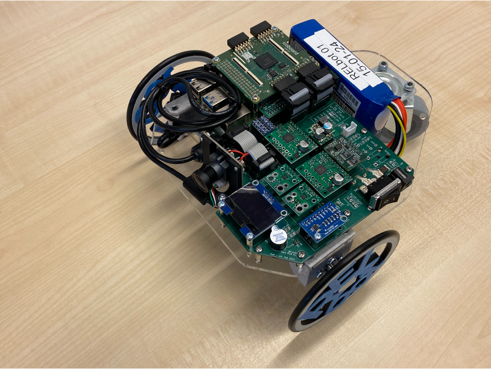
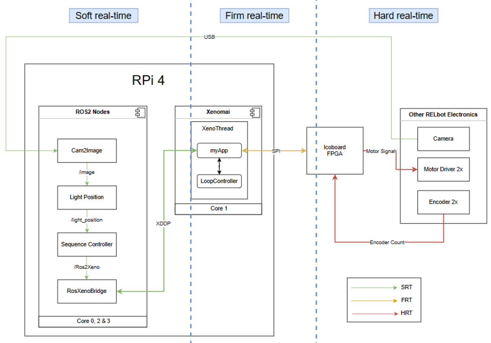

# RELbot


[](images/RELbot.png)
*Figure 1: RELbot hardware - Differential-drive mobile robot with Raspberry Pi 4, Icoboard FPGA, motor drivers, wheel encoders and USB camera.*

RELbot is a differential drive mobile robot meant to chase a green ball. The various electronics components as well as the software architecture is laid down in the block diagram in Figure 2. Most of the computational tasks are deployed using ROS2-humble. A real-time core is implemented using [Xenomai kernel](https://v4.xenomai.org/overview/) for tasks with strict timing constraints. Jitter analysis showed that Real-Time Linux with POSIX timer is not sufficient for periodic tasks with strict timing deadlines (1 ms), hence the motivation to use Xenomai as the real-time kernel for such tasks.

[](images/Blockdiagram.png)
*Figure 2: High level block diagram of RELbot's cyber-physical system.*

- Raspberry Pi 4 (4 CPU cores, Ubuntu 22.04)
  1. ROS2: Running on core 0, 2, 3 - scheduled by the Linux kernel
        - Cam2Image node: Converts USB video input to image frames and publishes it.
        - Light Position node: Computes center of gravity of green ball using HSV color segmentation and publishes it.
        - Sequence Controller node: Computes wheel motor velocity setpoint using inverse kinematics of differential-drive and publishes it.
        - RosXenoBridge Node: Establishes communication between ROS2 and Xenomai.
  2. Xenomai: Running on core 1 - scheduled by the Xenomai kernel.
        - XenoThread: Generates PWM values via a 20-sim generated PID controller that uses the wheel motor set point values sent from the sequence controller and the encoder values sent from the FPGA.
- Icoboard FPGA
  - Sends PWM signal to motor driver.
  - Counts wheel encoder pulse and sends to XenoThread.


## How to run?
This code is only meant to be run on the same environment as RELbot. Running the code in this project takes 3 terminal instances. 

#### Build and source the ROS packages

Run the command to build the project:
```
colcon build
```

On the same directory, source the installation to overlay the built ROS packages by running the command:
```
source install/setup.bash
```

In the following instructions, a terminal called **ROS Sourced Terminal** is assumed to have sourced the installation setup script.

#### Build the Xeno thread

On a **ROS Sourced Terminal**, Change your directory to `src/xeno_thread/` and run the following commands to build the xeno thread:
```
mkdir build
cd build
cmake ..
make
```

### ROS Sourced Terminal #1

Run the image node, light position node as well as the sequence controller nodes by the command:
```
ros2 launch asdfr_group7 sequence_controller.launch.py
```

### ROS Sourced Terminal #2

Run the ROS-Xenomai bridge node by the command:
```
bash RosXenoBridge.bash
```

### Terminal #3

Under `src/xeno_thread/build`, run the process that runs on the Xenomai core by the command:
```
sudo ./xenoThread
```

### Output

The robot should track the green object in its field of view. 

Note that the image processing is optimized at the test lab using the HSV color space where the minimum saturation value of 150, which seems to work well in room light but not with sunlight. It can be adjusted on run time by the command: 
```
ros2 param set /lightposition s_lo [VALUE]
```

where [VALUE] can be set between 0 and 255.
In our tests, we saw that:
- a low value of 75-100 works better for sunlight
- 150+ works better in darker/room light lit environments.

To see the filtered image by the light position node, you can run:
 ```
ros2 param set /lightposition debug true